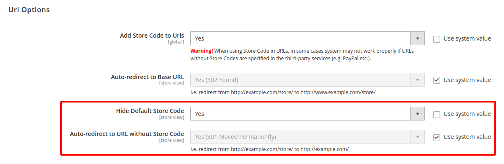

# HideDefaultStoreCode

Magento 2 module for hide *Default Store Code* from URL.

<https://bender.kr.ua/howto-hide-default-store-code-from-url-magento-2/>



***

## INSTALLATION

### manual

1. Download ZIP file and extract to **app/code/Noon/HideDefaultStoreCode**. If this path not exists, please create under Magento2 root directory.
2. Run the command in Magento2 root directory:

```bash
php bin/magento setup:upgrade
```

### composer

1. Run the command in Magento2 root directory:

```bash
composer require noon/hide-default-store-code
php bin/magento setup:upgrade
```

## CONFIGURATION

### ENABLE/DISABLE 

*Stores > Configuration > General > Web > Url Options > Hide Default Store Code*

### REDIRECT

*Stores > Configuration > General > Web > Url Options > Auto-redirect to URL without Store Code*

***

<a href="https://www.buymeacoffee.com/alex79" target="_blank"></a>
